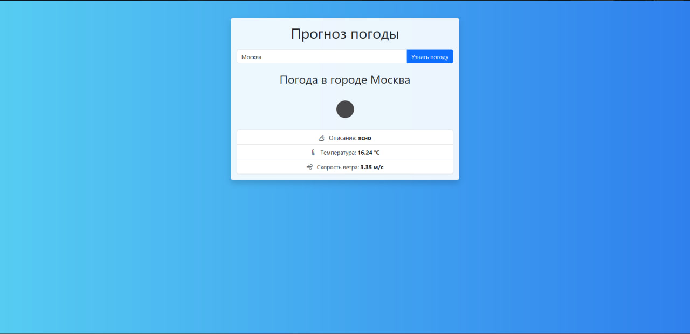

# Django Weather Forecast 🌤️

Небольшое Django-приложение, которое позволяет пользователю узнать текущую погоду в любом городе. Использует **Open-Meteo API** и автодополнение городов с помощью **geocoding-api**.

## 📸 Скриншот

## ⚙️ Возможности

- Ввод названия города
- Автодополнение при вводе (подсказки городов)
- Получение текущей температуры и скорости ветра
- Простая и адаптивная верстка на Bootstrap 5

## 🚀 Установка и запуск

git clone https://github.com/твоя-ссылка/weather_forecast.git
cd weather_forecast
python -m venv venv
source venv/bin/activate  # Linux/macOS
venv\Scripts\activate     # Windows
pip install -r requirements.txt
python manage.py runserver

# Используемые технологии

Django

HTML / Bootstrap 5

JavaScript (fetch API)

Open-Meteo API:

Geocoding API

Forecast API

# 📌 Примечания

Приложение не требует ключа API.

Подсказки работают через JavaScript — убедитесь, что JS включён в браузере.

